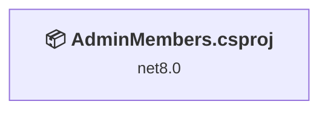
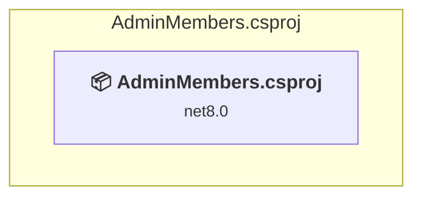

# Projects and dependencies analysis

This document provides a comprehensive overview of the projects and their dependencies in the context of upgrading to .NETCoreApp,Version=v10.0.

## Table of Contents

- [Executive Summary](#executive-Summary)
  - [Highlevel Metrics](#highlevel-metrics)
  - [Projects Compatibility](#projects-compatibility)
  - [Package Compatibility](#package-compatibility)
  - [API Compatibility](#api-compatibility)
- [Aggregate NuGet packages details](#aggregate-nuget-packages-details)
- [Top API Migration Challenges](#top-api-migration-challenges)
  - [Technologies and Features](#technologies-and-features)
  - [Most Frequent API Issues](#most-frequent-api-issues)
- [Projects Relationship Graph](#projects-relationship-graph)
- [Project Details](#project-details)

  - [AdminMembers.csproj](#adminmemberscsproj)

## Executive Summary

### Highlevel Metrics

| Metric | Count | Status |
| :--- | :---: | :--- |
| Total Projects | 1 | All require upgrade |
| Total NuGet Packages | 11 | 4 need upgrade |
| Total Code Files | 119 |  |
| Total Code Files with Incidents | 10 |  |
| Total Lines of Code | 22941 |  |
| Total Number of Issues | 46 |  |
| Estimated LOC to modify | 41+ | at least 0,2% of codebase |

### Projects Compatibility

| Project | Target Framework | Difficulty | Package Issues | API Issues | Est. LOC Impact | Description |
| :--- | :---: | :---: | :---: | :---: | :---: | :--- |
| [AdminMembers.csproj](#adminmemberscsproj) | net8.0 | 🟢 Low | 4 | 41 | 41+ | AspNetCore, Sdk Style = True |

### Package Compatibility

| Status | Count | Percentage |
| :--- | :---: | :---: |
| ✅ Compatible | 7 | 63,6% |
| ⚠️ Incompatible | 1 | 9,1% |
| 🔄 Upgrade Recommended | 3 | 27,3% |
| ***Total NuGet Packages*** | ***11*** | ***100%*** |

### API Compatibility

| Category | Count | Impact |
| :--- | :---: | :--- |
| 🔴 Binary Incompatible | 10 | High - Require code changes |
| 🟡 Source Incompatible | 16 | Medium - Needs re-compilation and potential conflicting API error fixing |
| 🔵 Behavioral change | 15 | Low - Behavioral changes that may require testing at runtime |
| ✅ Compatible | 44925 |  |
| ***Total APIs Analyzed*** | ***44966*** |  |

## Aggregate NuGet packages details

| Package | Current Version | Suggested Version | Projects | Description |
| :--- | :---: | :---: | :--- | :--- |
| Azure.Identity | 1.14.0 |  | [AdminMembers.csproj](#adminmemberscsproj) | ⚠️NuGet package is deprecated |
| Azure.Storage.Blobs | 12.24.0 |  | [AdminMembers.csproj](#adminmemberscsproj) | ✅Compatible |
| ClosedXML | 0.102.2 |  | [AdminMembers.csproj](#adminmemberscsproj) | ✅Compatible |
| iTextSharp.LGPLv2.Core | 3.4.11 |  | [AdminMembers.csproj](#adminmemberscsproj) | ✅Compatible |
| MailKit | 4.3.0 |  | [AdminMembers.csproj](#adminmemberscsproj) | ✅Compatible |
| Microsoft.EntityFrameworkCore.InMemory | 8.0.0 | 10.0.5 | [AdminMembers.csproj](#adminmemberscsproj) | NuGet package upgrade is recommended |
| Microsoft.EntityFrameworkCore.SqlServer | 8.0.0 | 10.0.5 | [AdminMembers.csproj](#adminmemberscsproj) | NuGet package upgrade is recommended |
| Microsoft.EntityFrameworkCore.Tools | 8.0.0 | 10.0.5 | [AdminMembers.csproj](#adminmemberscsproj) | NuGet package upgrade is recommended |
| Otp.NET | 1.4.0 |  | [AdminMembers.csproj](#adminmemberscsproj) | ✅Compatible |
| QRCoder | 1.4.3 |  | [AdminMembers.csproj](#adminmemberscsproj) | ✅Compatible |
| Swashbuckle.AspNetCore | 6.6.2 |  | [AdminMembers.csproj](#adminmemberscsproj) | ✅Compatible |

## Top API Migration Challenges

### Technologies and Features

| Technology | Issues | Percentage | Migration Path |
| :--- | :---: | :---: | :--- |

### Most Frequent API Issues

| API | Count | Percentage | Category |
| :--- | :---: | :---: | :--- |
| T:System.Uri | 13 | 31,7% | Behavioral Change |
| M:Microsoft.Extensions.Configuration.ConfigurationBinder.GetValue''1(Microsoft.Extensions.Configuration.IConfiguration,System.String) | 10 | 24,4% | Binary Incompatible |
| T:System.Security.Cryptography.Rfc2898DeriveBytes | 5 | 12,2% | Source Incompatible |
| M:System.Security.Cryptography.Rfc2898DeriveBytes.Pbkdf2(System.String,System.Byte[],System.Int32,System.Security.Cryptography.HashAlgorithmName,System.Int32) | 5 | 12,2% | Source Incompatible |
| M:System.TimeSpan.FromMinutes(System.Double) | 2 | 4,9% | Source Incompatible |
| M:System.TimeSpan.FromSeconds(System.Double) | 2 | 4,9% | Source Incompatible |
| T:System.BinaryData | 1 | 2,4% | Source Incompatible |
| M:System.BinaryData.ToArray | 1 | 2,4% | Source Incompatible |
| M:Microsoft.AspNetCore.Builder.ExceptionHandlerExtensions.UseExceptionHandler(Microsoft.AspNetCore.Builder.IApplicationBuilder,System.String) | 1 | 2,4% | Behavioral Change |
| M:System.Uri.#ctor(System.String) | 1 | 2,4% | Behavioral Change |

## Projects Relationship Graph

Legend:
📦 SDK-style project
⚙️ Classic project

## Project Details

### AdminMembers.csproj

#### Project Info

- **Current Target Framework:** net8.0
- **Proposed Target Framework:** net10.0
- **SDK-style**: True
- **Project Kind:** AspNetCore
- **Dependencies**: 0
- **Dependants**: 0
- **Number of Files**: 126
- **Number of Files with Incidents**: 10
- **Lines of Code**: 22941
- **Estimated LOC to modify**: 41+ (at least 0,2% of the project)

#### Dependency Graph

Legend:
📦 SDK-style project
⚙️ Classic project

### API Compatibility

| Category | Count | Impact |
| :--- | :---: | :--- |
| 🔴 Binary Incompatible | 10 | High - Require code changes |
| 🟡 Source Incompatible | 16 | Medium - Needs re-compilation and potential conflicting API error fixing |
| 🔵 Behavioral change | 15 | Low - Behavioral changes that may require testing at runtime |
| ✅ Compatible | 44925 |  |
| ***Total APIs Analyzed*** | ***44966*** |  |

